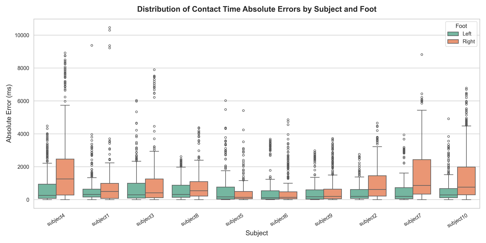

# Contact Time Evaluation for FootFormer

This directory contains the scripts and logs for evaluating the **Contact Time Mean Absolute Error (MAE)** between the vision-only predictions (FootFormer) and the pressure mat ground truth on the PSU-TMM100 dataset.

## 1. Overview
The primary goal of this evaluation is to quantify the temporal ambiguity inherent in vision-only modalities when predicting exact foot contact events (e.g., heel-strike to toe-off). All evaluations are standardized to a **50 FPS** temporal resolution (1 frame = 20 ms).

## 2. Generating Raw Prediction Data
To extract the raw predicted and ground truth contact arrays, we utilize the evaluation pipeline with the output saving flag enabled. 

**Configuration:**
We use the default 2D configuration file provided in the original FootFormer source code (`configs/ff_all_com_2D.yaml`). 
Ensure `save_output: true` is set in the `eval` section of this config file. Also, ensure any strict distribution assertions in `pressure/data/data_support.py` are temporarily muted if binary contact output is sufficient for this test.

**Command:**
Run the evaluation script from the project root directory:

    # Note: configs/ff_all_com_2D.yaml is the official config from the source code.
    PYTHONPATH=. python3 scripts/eval.py --config configs/ff_all_com_2D.yaml

**Output:**
This command will process all test subjects and generate serialized pickle files containing the raw tensors (e.g., `subject1_output.pkl`) in your designated `Results/.../eval/output/` directory.

## 3. Computing the Contact Time MAE (`compute_mae.py`)
Because raw frame-by-frame differencing does not accurately reflect step-level duration errors, we designed a custom evaluation script `compute_mae.py` to handle event extraction and temporal matching.

### How it Works (Methodology)
1. **Strict Binarization:** Both the Ground Truth (GT) and Predicted arrays are strictly binarized using a `> 0.5` threshold to eliminate floating-point artifacts generated during the unnormalization process.
2. **Event Extraction:** We utilize Connected-Component Labeling (`scipy.ndimage.label`) to group continuous sequences of `1`s into distinct, independent "Contact Events" (representing a full stance phase).
3. **Temporal Matching:** For each true GT contact event, the script searches for the temporally closest predicted event based on their midpoints.
4. **Error Calculation:** The absolute difference in duration (number of frames) between the matched GT event and the predicted event is calculated. False negatives (missed steps) are fully penalized. Frame errors are multiplied by `20 ms` to yield the absolute time error.

### Running the Script
Ensure the `pkl_files` glob path in the script matches your actual result directory, then run:

    python3 evaluation_metrics/compute_mae.py

### Outputs Generated
Running the script will automatically generate two files in the current directory:
* `summary_average_mae.txt`: A clean text log containing the calculated macro-average MAE for the left foot, right foot, and the overall grand average across all subjects. **(Refer to this file for the exact ~792 ms derivation).**
* `all_contact_errors.csv`: A highly detailed CSV file logging the exact error (in ms) for *every single matched step* for each foot of each subject. 

## 4. Results & Visualization (`analyze_errors.py`)
To better understand the distribution of errors and the impact of visual occlusion, we designed an analysis script (`analyze_errors.py`) to process the detailed CSV log and generate a statistical boxplot.

### Generating the Boxplot
**Dependencies:** Ensure you have the required plotting libraries installed:

    pip install pandas matplotlib seaborn

**Command:** Run the analysis script in the same directory as the generated CSV file:

    python3 evaluation_metrics/analyze_errors.py

*This script reads `all_contact_errors.csv` and outputs the high-resolution `contact_errors_distribution.png`.*

  
  
<em>Figure: Distribution of Contact Time Absolute Errors by Subject and Foot</em>

**Key Observations & Conclusions:**
* **Quantitative Baseline:** As recorded in `summary_average_mae.txt`, the overall average Contact Time MAE across all subjects is approximately **~792 ms**. This high average error establishes a clear quantitative baseline demonstrating the limitations of a vision-only approach.
* **Impact of Occlusion:** While the interquartile range for unobstructed steps remains relatively low (typically under 500 ms), severe outlier errors (exceeding 2000-4000 ms) frequently occur.
* **Asymmetric Failure:** The extreme variance between the left and right foot for specific subjects (e.g., Subject 4, 7, 10) strongly suggests that **severe visual occlusion completely degrades temporal accuracy**. When one leg blocks the other from the camera's perspective, the pure RGB/Skeleton model loses its ability to localize contact events accurately.